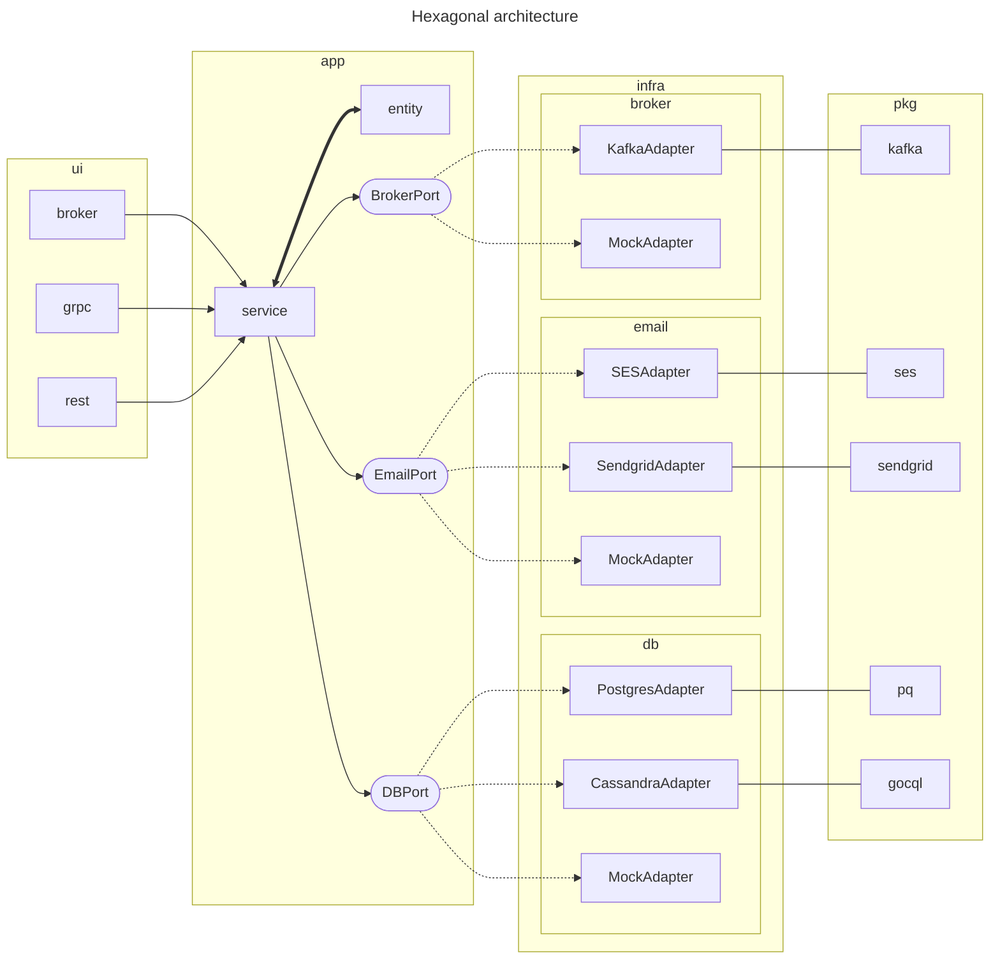

# Hexagonal Architecture


Following a simpler diagram:



Achieved by the folder structure:

```
.
├── app
│   └── service
|       ├── service.x
|       ├── ports.x
│       └── entities.x
├── infra
│   ├── broker
|   |   ├── mock
|   |   |   └── adapter.x
|   |   └── kafka
|   |       └── adapter.x
│   ├── db
|   |   ├── mock
|   |   |   └── adapter.x
|   |   ├── postgres
|   |   |   └── adapter.x
|   |   └── cassandra
|   |       └── adapter.x
│   └── email
|       ├── mock
|       |   └── adapter.x
|       ├── ses
|       |   └── adapter.x
|       └── sendgrid
|           └── adapter.x
└── ui
    ├── cli
    ├── broker
    ├── grpc
    └── rest
```
 

